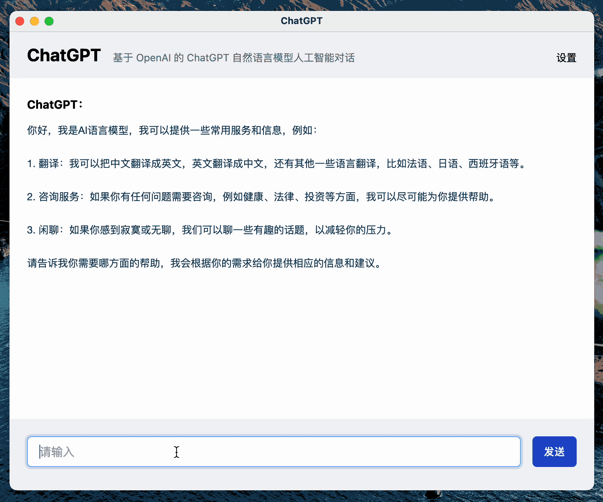

# chatTests

目前网站通过 Vue3 + Typescript + Tailwind CSS 框架，调用openAI GPT3.5模型 API，
实现随机出单选题和连续对话辅导，可在网页上直接记录纯文本笔记并导出。

PS：需设置自己可用的OpenAI Key，目前仅建议PC端使用

体验网站1：https://yfor-chattests.hf.space/ (huggingface 部署)

体验网站2：https://x3dsk4-5173.csb.app/ (codeSandBox 部署如打不开，可在文档中留言)

项目源代码：https://github.com/Aomferni/chatTests

项目更多详情请查看飞书文档：https://hk4llw3wld.feishu.cn/docx/IeoQdvZcQo51Yzx8oJIcHSjqnyg

内测交流群见：

对投入项目后续优化可带自我介绍戳：

## ChatTest 项目愿景

  让考试和题目/问题，回归到辅助学习的核心作用上
  
  搭建通过确定的题目探索边界搭建知识框架的学习平台，提高理论知识学习效率；
  
  让用户掌控考试，利用考试提升个人对领域的理解，而不是被考试掌控

## 自部署指南
推荐直接fork到自己的仓库，使用codeSandBox进行自动部署。

## 许可证

本项目使用 [MIT](LICENSE) 协议
